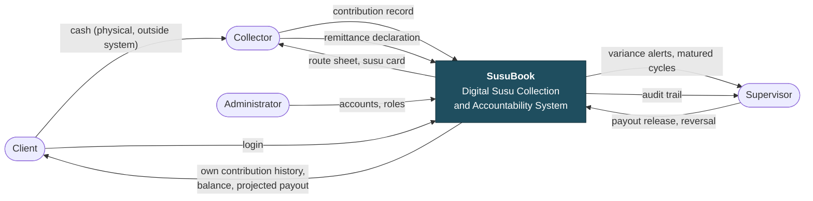
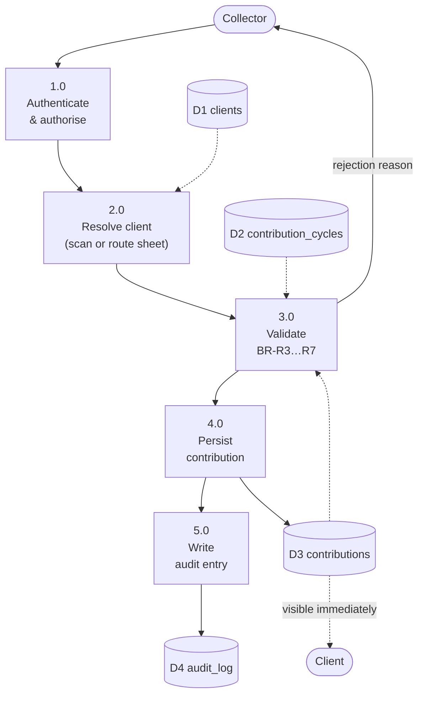
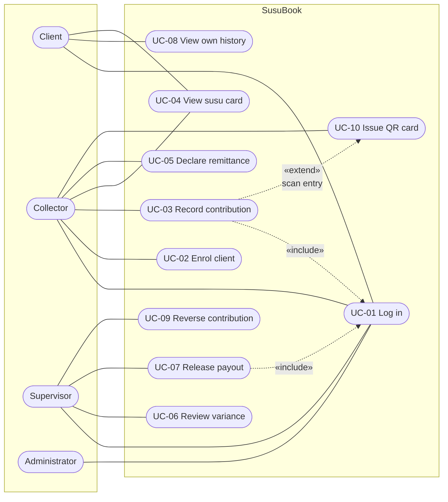
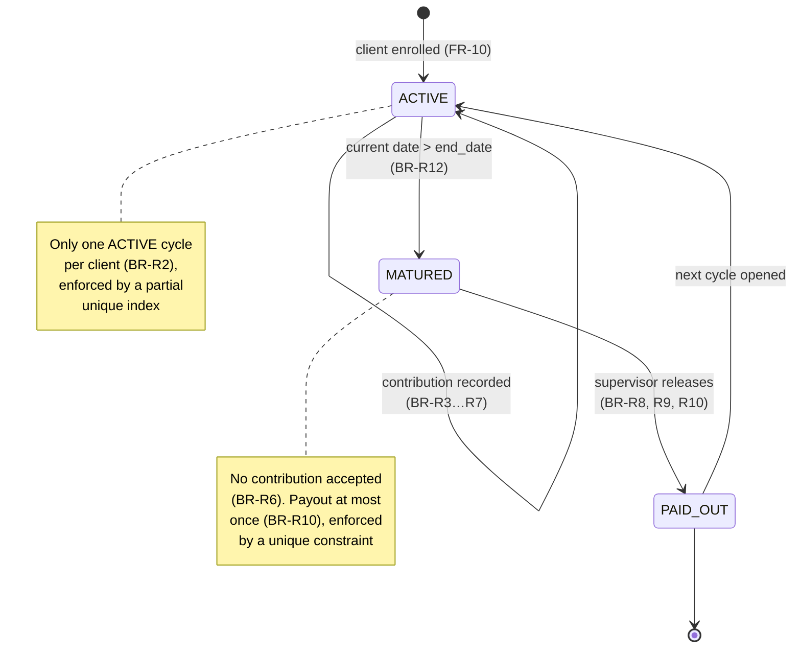
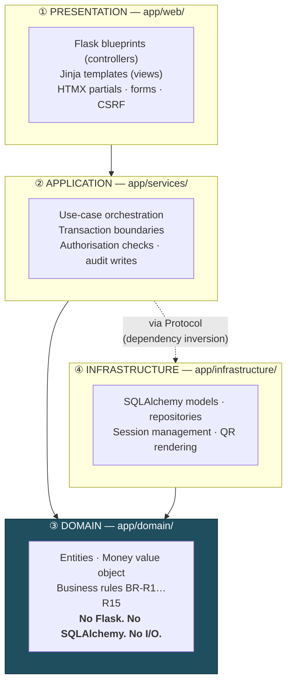
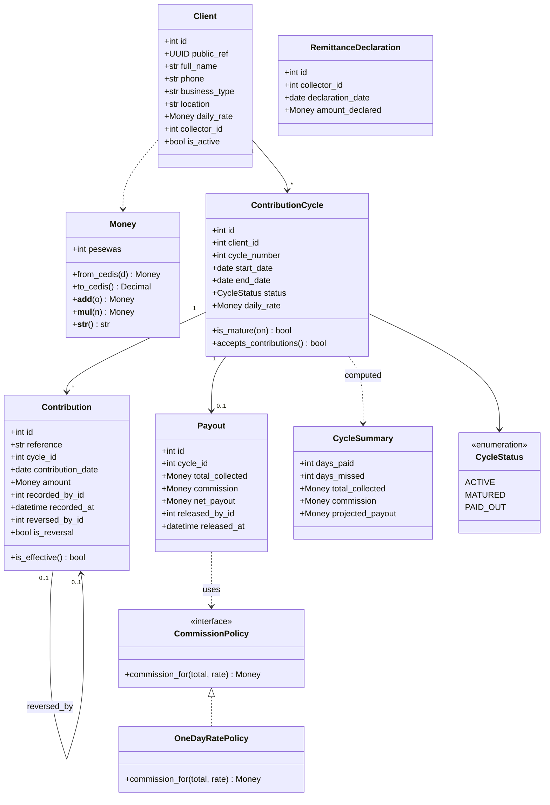
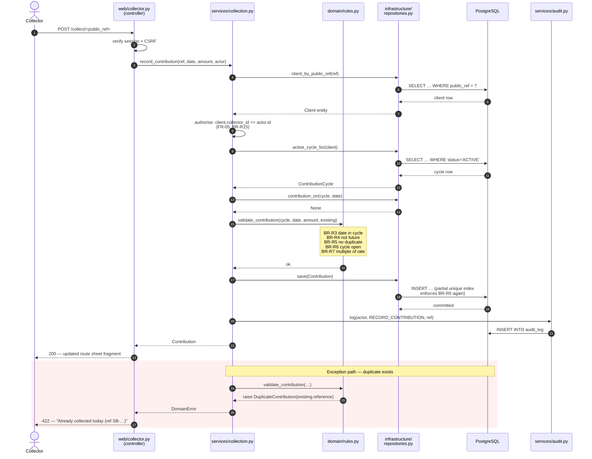
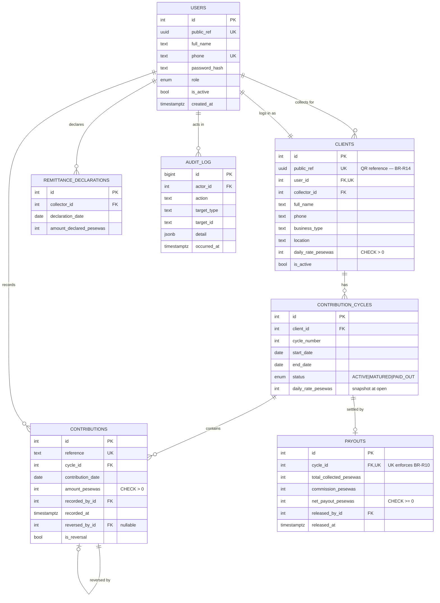

# 7. System Analysis and Design

Covers examination document sections 8 (System analysis) and 9 (System design).

---

# PART A: SYSTEM ANALYSIS

## 7.1 Analysis of the current (manual) system

| Aspect | Current manual process |
|---|---|
| **Record medium** | A paper card with 31 boxes, held by the collector |
| **Recording act** | Collector marks a box, sometimes initials it |
| **Client's copy** | None. The client holds nothing. |
| **Computation** | Manual, at maturity, by the collector |
| **Reconciliation** | Cash counted at the branch against the collector's own tally |
| **Audit trail** | None beyond the card itself |
| **Failure detection** | On dispute, or when a collector disappears |

**Structural weakness.** The party whose conduct requires verification is the sole custodian
of the evidence. Every failure identified in §1.2 (P1–P4) descends from that one
fact, so the analysis below treats *separating the record from the collector* as the
system's defining requirement rather than one feature among many.

## 7.2 Context diagram (Level 0 DFD)



The arrow from the client **into** the system, independent of the collector's, is the
structural change. Everything else is bookkeeping around it.

## 7.3 Level 1 data flow: recording a contribution



## 7.4 Use case diagram



## 7.5 Contribution cycle state model

The cycle's lifecycle carries several business rules, so it is modelled explicitly.



---

# PART B: SYSTEM DESIGN

## 7.6 Architectural style: layered (N-tier)

Session 5 presents three architectural options. Each was assessed against this project:

| Style | Assessment | Decision |
|---|---|---|
| **Microservices** | Session 5 lists the preconditions: large teams in parallel, independent scaling, differing stacks, high availability. **None** hold here, one developer, one deployment, free-tier hosting. It would add distributed-tracing and partial-failure complexity for no benefit, and Session 5 explicitly warns it "requires DevOps maturity". | Rejected |
| **MVC alone** | Accurate for the web tier but says nothing about where business rules live. Applied *within* the presentation layer rather than as the whole architecture. | Partially adopted |
| **Layered (N-tier)** | Enforces the downward dependency rule, isolates business rules from Flask and the database, and directly enables NFR-07 (domain testable without a database). | **Selected** |

### Layer stack

Mapped onto Session 5's "Common Layer Stack" slide:



**The dependency rule.** Dependencies point downward only. The domain layer depends on
nothing, not Flask, not SQLAlchemy, not the network. It is plain Python.

**Why this matters more than it looks.** It is what makes the 5 marks for testing
achievable. Business rules can be unit-tested with no database, no HTTP client and no
fixtures, so the tests run in milliseconds and can be written in the time available. An
Active-Record design where rules live on ORM models would require a live database for
every rule test, and under a 48-hour budget those tests simply would not get written.

**The sinkhole risk.** Session 5 warns of the sinkhole anti-pattern, requests passing
through layers that add nothing. Accepted here: simple reads (e.g. listing clients) pass
through the service layer with little transformation. The cost is a few extra function
calls; the benefit is one consistent path for authorisation and audit. Recorded as
**TD-08**.

## 7.7 Project structure

The folder tree *is* the architecture diagram:

```
app/
├── __init__.py              application factory, dependency wiring
├── config.py                environment-driven configuration
├── domain/                  ③ pure Python — no framework imports
│   ├── money.py             Money value object (integer pesewas)
│   ├── entities.py          Client, ContributionCycle, Contribution, Payout …
│   ├── rules.py             BR-R1…R15 as pure functions
│   └── errors.py            DomainError hierarchy
├── services/                ② use-case orchestration
│   ├── protocols.py         repository Protocols (dependency inversion)
│   ├── enrolment.py         UC-02
│   ├── collection.py        UC-03, UC-09
│   ├── payout.py            UC-07
│   ├── reconciliation.py    UC-05, UC-06
│   └── audit.py             append-only audit writes
├── infrastructure/          ④ framework-bound
│   ├── models.py            SQLAlchemy ORM models
│   ├── repositories.py      Protocol implementations
│   ├── db.py                engine, session, create_all
│   └── qrcodes.py           segno SVG rendering
└── web/                     ① controllers and views
    ├── auth.py              blueprint
    ├── collector.py         blueprint
    ├── supervisor.py        blueprint
    ├── client.py            blueprint
    ├── templates/
    └── static/
tests/
├── unit/                    domain rules — no database
├── integration/             services + repositories against Postgres
└── system/                  end-to-end through the Flask test client
```

## 7.8 Technology stack justification

The syllabus lab toolkit [7] lists React, TypeScript, Node and Mongo/MySQL. Flask
and HTMX are not named, though Python is. Examination Rule 6 requires that frameworks be acknowledged,
which this section does; the choice is defended on architectural grounds.

| Layer | Choice | Justification |
|---|---|---|
| **Language** | Python 3.12 | Named in the syllabus toolkit. Dataclasses and `typing.Protocol` express the domain layer and dependency inversion directly. |
| **Web framework** | Flask 3 | A microframework imposes no architecture, so the layered design is genuinely ours rather than the framework's. Blueprints give modular controllers. |
| **Templating** | Jinja2 | Server-rendered HTML — Session 5's MVC pattern, the same family as Django and Rails which that slide names. |
| **Interactivity** | HTMX | The interaction set (forms, tables, inline validation, confirmations) needs partial page updates, not client-side state. HTMX delivers these by returning HTML fragments, with no build step, no bundler and no hydration. |
| **ORM** | SQLAlchemy 2 | Confined to the infrastructure layer. The repository boundary keeps it out of the domain, satisfying NFR-07. |
| **Database** | PostgreSQL 16 | Partial unique indexes let three business invariants be enforced in the database as well as in code (§7.11). Identical engine in dev (Docker) and production, satisfying NFR-10. |
| **QR rendering** | segno | Pure Python, no Pillow dependency, emits inline SVG that scales without an image pipeline. |
| **Testing** | pytest + coverage | The domain layer's independence makes fast, database-free unit tests possible. |
| **Containerisation** | Docker Compose (dev) | Dev/prod parity on the same Postgres engine. |

### Why not React

Considered and rejected, on four grounds:

1. **The architecture would be documented, not demonstrated.** A React SPA plus a JSON API means two deployables, CORS configuration and a build toolchain: none of which express a layered architecture any better than server-rendered MVC does.
2. **Deployment risk.** Two services to deploy instead of one, against examination Rule 8 which requires the deployment to remain accessible for grading.
3. **Testing cost.** Server-side business logic is far cheaper to test than component trees, and testing carries 5 marks with no lecture deck to lean on.
4. **The interactivity is not there.** React earns its complexity with substantial client-side state: drag-and-drop, offline-first, realtime collaboration. SusuBook has none of that.

**The honest trade-off.** HTMX means a network round trip for interactions React would handle locally. Under NFR-01 (2 s on a 3G-class connection) that is a real cost. It is accepted because the payloads are small HTML fragments, and it is mitigated by keeping the three highest-frequency interactions (the ones on the collector's critical path) as the partial updates HTMX is applied to.

## 7.9 Domain class diagram



## 7.10 Sequence diagram: UC-03 record contribution



Steps 3–4 are what resolves conflict **C1** from §2.4: the collector supplies one
confirmation, while attribution, timestamping and audit are added server-side at no
interaction cost.

## 7.11 Database design

### Entity-relationship diagram



### Business invariants enforced in the database

Three rules are enforced **twice**, in the domain layer and again by the schema. This is
deliberate defence in depth: a bug in the service layer, or a future direct database write,
cannot corrupt these invariants.

| Rule | Database mechanism |
|---|---|
| **BR-R2**, one ACTIVE cycle per client | `CREATE UNIQUE INDEX ux_active_cycle ON contribution_cycles (client_id) WHERE status = 'ACTIVE'` |
| **BR-R5**, one effective contribution per client per date | `CREATE UNIQUE INDEX ux_contribution_day ON contributions (cycle_id, contribution_date) WHERE reversed_by_id IS NULL AND is_reversal = FALSE` |
| **BR-R10**, at most one payout per cycle | `UNIQUE (cycle_id)` on `payouts` |
| **BR-R1**, money is integral | every monetary column is `INTEGER` pesewas; no `FLOAT`, `REAL` or `MONEY` type appears in the schema |

PostgreSQL's partial unique indexes are the specific reason it was chosen over MySQL: the
first two rules cannot be expressed as plain unique constraints, because reversed
contributions must be allowed to coexist with their replacements on the same date.

### Indexes

| Index | Purpose |
|---|---|
| `clients (public_ref)` unique | QR reference resolution (FR-40) |
| `clients (collector_id)` | Route sheet (FR-23) |
| `contribution_cycles (client_id, status)` | Active cycle lookup, the hottest query |
| `contributions (cycle_id)` | Susu card rendering (FR-16) |
| `contributions (recorded_by_id, recorded_at)` | Daily variance computation (FR-25) |
| `audit_log (target_type, target_id)` | Audit trail retrieval (FR-34) |

### Money representation

All monetary values are `INTEGER` pesewas, wrapped in a `Money` value object in the domain
layer. GHS 2.50 is stored as `250`.

This is a deliberate decision against the obvious alternative. Binary floating point cannot
represent 0.1 exactly, so accumulating 31 daily contributions of GHS 0.10 as floats yields
3.0000000000000004 rather than 3.10. On a savings system, a rounding error of a pesewa
compounding across thousands of clients is both a correctness defect and a trust failure —
and this system exists to establish trust. `Decimal` would also be correct, but integers are
faster, map exactly onto an `INTEGER` column, and make the invariant impossible to violate
accidentally.

## 7.12 Application of SOLID principles

Session 5's five principles [5], originally set out by Martin [15], each with
the concrete place it applies. Session 5 also notes
that SOLID compliance *reduces technical debt*, the connection to §8 is direct.

**S — Single Responsibility.**
`domain/rules.py` holds one pure function per computation (`validate_contribution`,
`compute_cycle_summary`, `compute_payout`, `compute_variance`). Services orchestrate but
compute nothing. `services/audit.py` does nothing but append audit entries. The bad example
on the slide (one class handling auth, email and reporting) is avoided by having no class
that spans concerns.

**O — Open/Closed.**
`CommissionPolicy` is an interface with `OneDayRatePolicy` as the shipped implementation.
FR-36 (configurable commission) is deferred, but when it arrives a `PercentagePolicy` is
*added*, not an edit to tested payout code. This is the slide's `PaymentMethod` example
applied to our actual deferred requirement.

**L — Liskov Substitution.**
Repository implementations are substitutable for their Protocols. The test suite injects
in-memory fakes wherever production injects SQLAlchemy repositories, and every service test
passes against both. That equivalence is the practical proof of substitutability.

**I — Interface Segregation.**
Separate narrow Protocols — `ClientRepository`, `CycleRepository`, `ContributionRepository`,
`PayoutRepository`, rather than one fat `DataAccess`. `PayoutService` depends only on what
it uses, so a change to contribution queries cannot break it.

**D — Dependency Inversion.**
Services depend on `typing.Protocol` abstractions; concrete SQLAlchemy repositories are
injected by the application factory. `PayoutService` never imports SQLAlchemy. This is what
makes the domain and service tests run without a database, and it is the principle the whole
architecture rests on.

## 7.13 Design patterns applied

| Pattern | Where | Why |
|---|---|---|
| **Layered architecture** | Whole application | Separation of concerns, testability (Session 5) |
| **MVC** | `web/`, blueprints, Jinja templates, models | Session 5's canonical web pattern |
| **Repository** | `infrastructure/repositories.py` | Decouples the business layer from the persistence technology [16][17] |
| **Service Layer** | `services/` | One place per use case for orchestration, transactions and audit |
| **Value Object** | `domain/money.py` | Money is compared and combined by value; immutability prevents a whole defect class [17] |
| **Strategy** | `CommissionPolicy` | Open/closed extension point for FR-36 [18] |
| **Application Factory** | `app/__init__.py` | Different wiring for production and tests, enables dependency injection |
| **Dependency Injection** | Factory-wired repositories | Session 5 names DI as the practical form of the D in SOLID |

## 7.14 Interface design

Mobile-first, because the collector is standing in a market and the client is on a low-end
phone (CO-07, NFR-08).

**Collector: route sheet (primary screen)**

```
┌─────────────────────────────────┐
│ ☰  Today · Mon 15 Sep      ₵0.00│
├─────────────────────────────────┤
│  [ 📷  Scan client card ]       │  ← QR path (FR-40), 1st interaction
├─────────────────────────────────┤
│  Ama Mensah      ₵5.00   ✓ Paid │
│  Kofi Boateng    ₵10.00  ⟩      │
│  Akosua Darko    ₵5.00   ⟩      │
│  Yaw Owusu       ₵20.00  ✓ Paid │
├─────────────────────────────────┤
│ Recorded today      ₵25.00      │
│ [ Declare remittance ]          │
└─────────────────────────────────┘
```

**Collector: confirm contribution** (reached by scan or by tapping a row)

```
┌─────────────────────────────────┐
│ ←  Kofi Boateng                 │
│    Kiosk · Madina Market        │
├─────────────────────────────────┤
│                                 │
│        ₵ 10.00                  │  ← pre-filled daily rate
│        Mon 15 Sep               │
│                                 │
│   ┌───────────────────────┐     │
│   │   CONFIRM COLLECTION  │     │  ← 2nd interaction. Done.
│   └───────────────────────┘     │
│                                 │
│   Change amount ⟩               │
├─────────────────────────────────┤
│ Day 12 of 31 · ₵110 saved       │
└─────────────────────────────────┘
```

Two interactions from scan to recorded, against NFR-02's limit of three.

**Client: my susu card** (the answer to P1)

```
┌─────────────────────────────────┐
│  Kofi Boateng      Cycle 3      │
├─────────────────────────────────┤
│  ■ ■ ■ ■ ■ ■ ■   1–7            │
│  ■ ■ □ ■ ■ ■ ■   8–14           │
│  ■ ■ ■ ■ ▫ ▫ ▫   15–21          │
│  ▫ ▫ ▫ ▫ ▫ ▫ ▫   22–28          │
│  ▫ ▫ ▫            29–31         │
│  ■ paid  □ missed  ▫ pending    │
├─────────────────────────────────┤
│  Days paid          17 of 18    │
│  Total saved        ₵170.00     │
│  Commission        −₵10.00      │
│  You will receive   ₵160.00     │
│  Matures            30 Sep      │
├─────────────────────────────────┤
│  Recent                         │
│  15 Sep ₵10  09:14  by J. Osei  │
│  14 Sep ₵10  08:52  by J. Osei  │
│  [ See all · SB-7K2M-… ]        │
└─────────────────────────────────┘
```

Every row names the recording collector and the time. That is the independent record the
paper card cannot provide.

**Supervisor: daily variance (the answer to P3)**

```
┌───────────────────────────────────────────┐
│ Variances · Mon 15 Sep                    │
├───────────────────────────────────────────┤
│ Collector      Recorded  Declared    Diff │
│ J. Osei         ₵340.00   ₵340.00   ₵0.00 │
│ M. Adjei        ₵285.00   ₵250.00  ₵35.00 │ ⚠
│ K. Tetteh       ₵410.00   ₵410.00   ₵0.00 │
├───────────────────────────────────────────┤
│ ⚠ 1 variance · ₵35.00 unaccounted         │
└───────────────────────────────────────────┘
```

### Visual identity

Two design elements carry meaning rather than decoration.

**The mark** is the susu card itself, a card outline containing nine days, the
first five filled and the rest faded. It is the same image the client sees on
their own card, reduced to nine squares, so the identity states what the product
does.

**The background motif is cowrie shells.** Cowries were currency across West
Africa for centuries, including the Gold Coast, and remain a cultural shorthand
for money and saving. A digital ledger for a traditional savings practice is
better placed in that tradition than in the visual language of a retail bank,
and the users this system is built for (market traders and kiosk owners) are
the people for whom that reference is legible.

Both are drawn as SVG, which is what makes them affordable. The motif is a
single ~2 KB cacheable tile; a raster background would have added weight to a
page whose performance budget is already exceeded (**TD-02**, §12.6). It is tiled
at 5% opacity behind the content cards and never beneath body text, so contrast
is set by the card rather than the background.

### Accessibility (NFR-08)

Interface work follows the user-centred design activities of ISO 9241-210 [28]
as presented in Session 5 [5].

WCAG 2.1 [29] AA contrast; touch targets of at least 44×44 px; the susu card grid uses **shape and text,
not colour alone**, to distinguish paid from missed, colour-blind users and a sun-washed
screen fail the same way, so the fix serves both. Amounts are rendered large; no
interaction depends on hover.

## 7.15 Security design (NFR-03)

| Control | Implementation |
|---|---|
| Password storage | Argon2id via `argon2-cffi`; no plaintext or reversible storage |
| Session management | Flask signed session cookies — `Secure`, `HttpOnly`, `SameSite=Lax`; idle timeout (FR-04) |
| CSRF | Token on every state-changing form (Flask-WTF) |
| Authorisation | Enforced **server-side in the service layer**, not in templates, hiding a link is not a control |
| Object-level authorisation | Every client-scoped operation re-checks `client.collector_id == actor.id` (FR-05) |
| IDOR / enumeration | Opaque UUIDv4 public references in all external URLs (BR-R14) |
| SQL injection | Parameterised queries only, via SQLAlchemy; no string-built SQL |
| Data minimisation | Name, phone, business type, location only, no Ghana Card, address or next of kin (NFR-06, Act 843) |
| Non-repudiation | Append-only audit log; corrections are reversals, never edits (BR-R11) |
| Transport | HTTPS enforced in production |

**Threat: a stolen or photographed QR card.** Mitigated by design rather than by secrecy.
The reference identifies but does not authorise (BR-R15): reaching a client's contribution
URL still requires an authenticated collector to whom that client is assigned. The QR
encodes a URL and an opaque reference only, so a photographed card discloses no personal
data.

---

## 7.16 Technical debt identified during design

Session 5's key takeaway (that SOLID compliance reduces technical debt) is treated
literally here: debt is identified at design time, before any is incurred, rather than
discovered afterwards. TD-01…TD-06 were created by the scope decision in
§4.6; TD-07…TD-11 arise from the design choices above.

| ID | Debt | Origin | Fowler quadrant | Type |
|---|---|---|---|---|
| TD-01 | `create_all()` instead of Alembic migrations | Scope cut | Prudent & deliberate | Infrastructure |
| TD-02 | Tailwind via CDN, unpurged | Scope cut | Prudent & deliberate | Design/Infrastructure |
| TD-03 | Client list without search or pagination | Scope cut | Prudent & deliberate | Usability |
| TD-04 | Minimal reversal form | Scope cut | Prudent & deliberate | Code |
| TD-05 | Static route sheet *(partly mitigated by CR-001)* | Scope cut | Prudent & deliberate | Usability |
| TD-06 | HTMX applied inconsistently | Scope cut | Prudent & deliberate | Design |
| **TD-07** | Hand-written mapping between domain dataclasses and ORM models, every schema change must be made in two places | Layered design (§7.6) | Prudent & deliberate | Architecture |
| **TD-08** | Sinkhole: simple reads pass through the service layer adding little | Layered design (§7.6) | Prudent & deliberate | Architecture |
| **TD-09** | Audit log is append-only by convention, not enforced by database permissions or a trigger | Time constraint | Prudent & deliberate | Architecture/Security |
| **TD-10** | Cycle maturity computed on read rather than by a scheduled job; a cycle no one opens is never marked MATURED | No scheduler on free-tier hosting | Prudent & deliberate | Architecture |
| **TD-11** | Cycle summaries recomputed from all contributions on every render; no caching or denormalised totals | Simplicity over optimisation | Prudent & inadvertent | Performance |

Every item is **prudent**, taken knowingly, for a stated reason, and all but TD-11 are
**deliberate**. TD-11 is classified *inadvertent* because the performance cost was
recognised only while designing the card view, which is precisely Fowler's "we now know how
we should have done it" quadrant.

Full cause → impact → priority → resolution analysis follows in Section 8 (Technical Debt).

## 7.17 Traceability: design decisions to requirements

| Design decision | Serves | Rationale |
|---|---|---|
| Layered architecture, domain isolated | NFR-07 | Domain testable without a database |
| Integer pesewas + `Money` value object | NFR-04, BR-R1 | Eliminates floating-point error on money |
| Partial unique indexes | BR-R2, BR-R5, BR-R10 | Invariants survive a service-layer bug |
| Opaque UUID public references | BR-R14, NFR-03 | Prevents enumeration and IDOR |
| Append-only audit log with reversals | BR-05, NFR-09, BR-R11 | Non-repudiation; resolves conflict C2 |
| Pre-filled amount, single confirmation | NFR-02 | Two interactions; resolves conflict C1 |
| Server-rendered HTML, small payloads | NFR-01, CO-07 | Works on low-end devices over mobile data |
| Shape and text, not colour alone | NFR-08 | Serves colour-blind users and sunlit screens alike |
| Same Postgres engine dev and prod | NFR-10 | Removes the class of defects that appear only in production |
| `CommissionPolicy` strategy | FR-36 (deferred) | Extension without modifying tested payout code |
