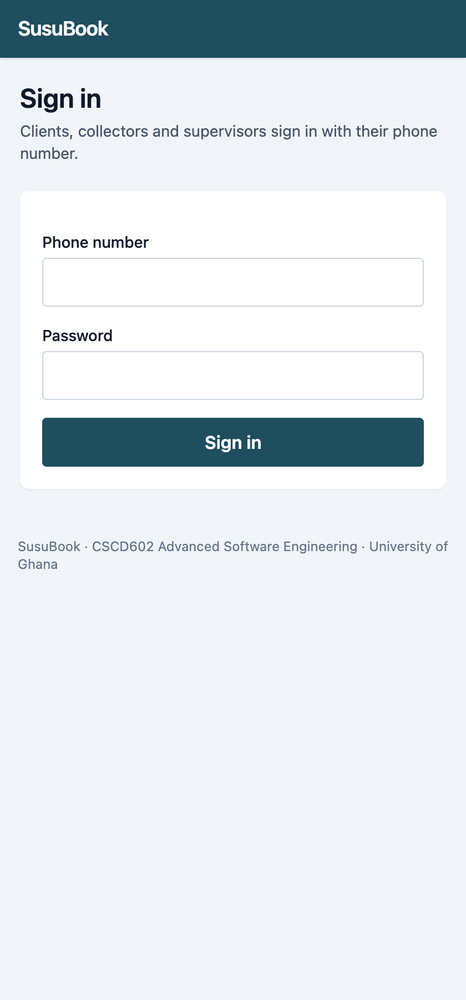
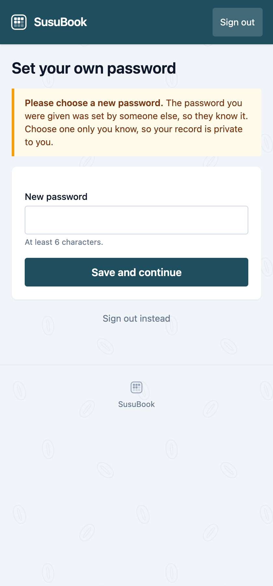
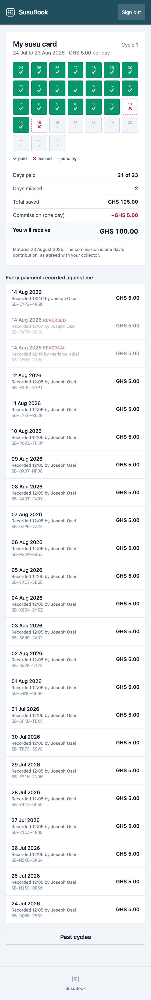
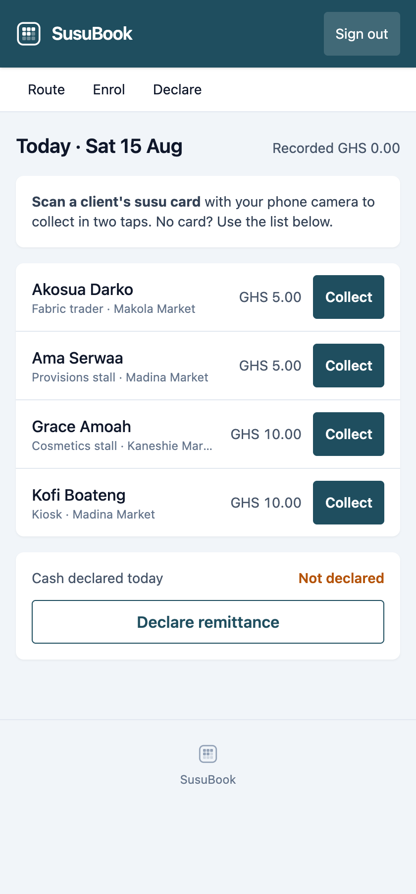
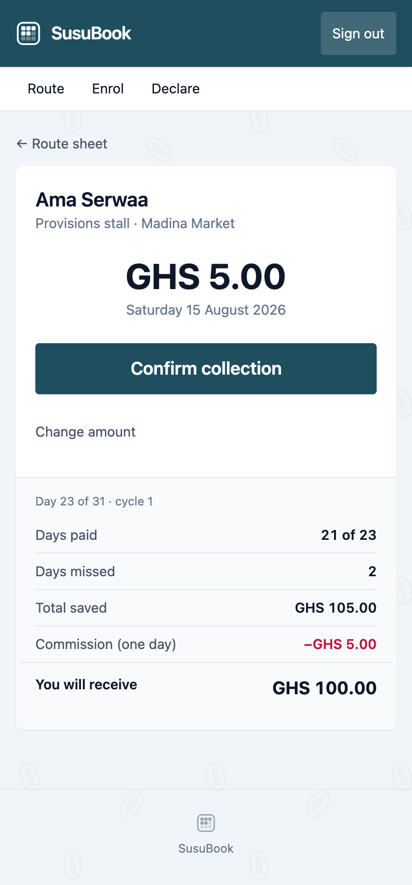
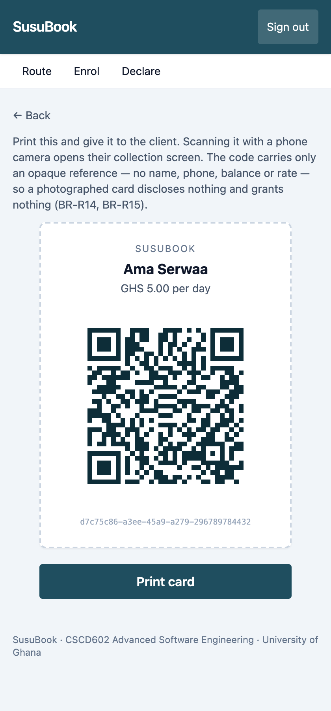
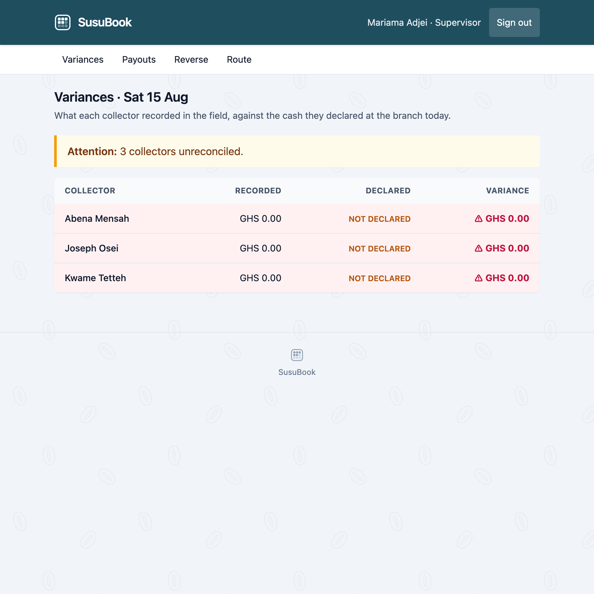
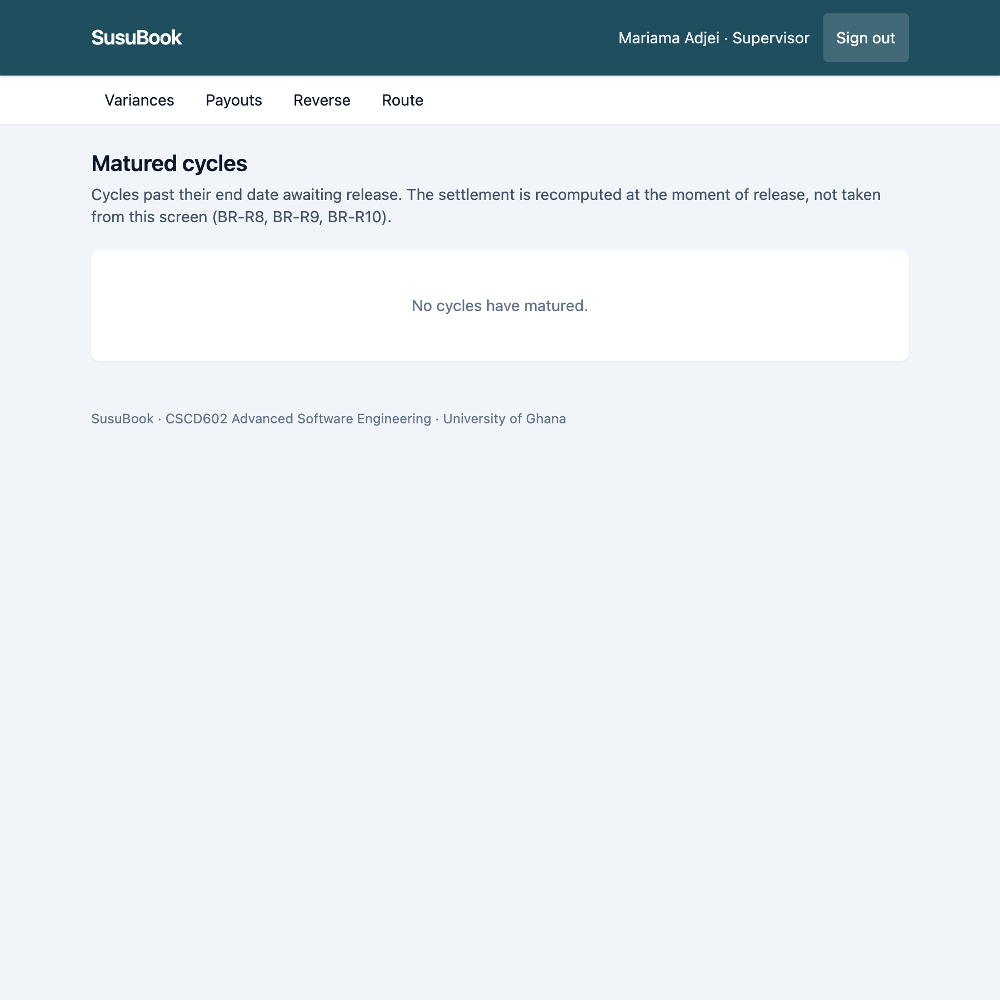

# SusuBook User Manual

**Version 1.0**

---

## Contents

1. [What SusuBook is](#1-what-susubook-is)
2. [Signing in](#2-signing-in)
3. [For clients, checking your savings](#3-for-clients--checking-your-savings)
4. [For collectors, daily collection](#4-for-collectors--daily-collection)
5. [For supervisors, oversight and payouts](#5-for-supervisors--oversight-and-payouts)
6. [For administrators](#6-for-administrators)
7. [Messages you may see](#7-messages-you-may-see)
8. [Common questions](#8-common-questions)
9. [Words used in this manual](#9-words-used-in-this-manual)

---

## 1. What SusuBook is

SusuBook replaces the paper susu card.

With a paper card, the collector holds the card and marks it. If the card is
lost, damaged, or the marks are disputed, the client has nothing to show for
their savings.

With SusuBook, **the client and the collector see the same record, and neither
can change what has already been recorded.** Every contribution shows the amount,
the date, the time it was recorded, and which collector recorded it.

Money is still cash. The collector still visits, and the client still hands over
the same amount as before. SusuBook records what happened.

**Four kinds of user:**

| | |
|---|---|
| **Client** | Saves a fixed amount each day and can check their own record at any time |
| **Collector** | Visits clients, receives cash, records each contribution |
| **Supervisor** | Oversees collectors, checks the day's cash, approves payouts |
| **Administrator** | Manages user accounts |

---

## 2. Signing in

Everyone signs in the same way, on any phone or computer:

**https://susubook-fdtbppd7sq-uc.a.run.app**

1. Enter your **phone number**, the one you gave when you registered
2. Enter your **password**
3. Tap **Sign in**

You will land on the right page for who you are. Clients see their own card;
collectors see today's route; supervisors see the day's cash position.

**If it does not work:** the message *"Phone number or password is incorrect"*
appears for both a wrong number and a wrong password. This is deliberate, it
stops a stranger from discovering which phone numbers are registered. Check both,
and if you still cannot sign in, ask your collector or branch to help.

> **Your first sign-in.** Your collector set your first password, so they know
> it. The first time you sign in, SusuBook asks you to choose a new one before
> showing your card. Choose something only you know, after that, nobody else
> can see your record.

**Forgotten your password?** Tap *Forgotten your password?* on the sign-in page
and enter your phone number. A six-digit code is sent to you by text. Enter the
code and choose a new password. The code lasts 10 minutes and works once.

---

## 3. For clients: checking your savings

### Your susu card

After signing in, you see your card for the current cycle.

**The grid** shows every day of your 31-day cycle:

| Mark | Meaning |
|---|---|
| **✓** green | You paid on that day |
| **✗** red, dashed | That day has passed and no payment was recorded |
| **·** grey | That day has not arrived yet |

The marks use both a **symbol and a colour**, so the card can be read in bright
sunlight and by anyone who has difficulty telling colours apart.

**Below the grid** you see:

- **Days paid**, how many days you have paid, out of the days so far
- **Total saved**, everything recorded for you this cycle
- **Commission**, one day's contribution, kept by the collector. This is the
  normal susu arrangement, agreed when you registered
- **You will receive**, what you get at the end of the cycle
- **Matures**, the date your cycle ends

### Every payment recorded against you

Below the card is the list of your payments. Each one shows:

- the **date**
- the **amount**
- the **time** it was recorded
- **which collector** recorded it
- a **reference** such as `SB-4K2M-7X9P`

**This is the important part.** If you ever disagree with your collector about a
payment, this list is your evidence. It is written when the collector records the
payment, and it cannot be quietly altered afterwards.

### If a payment is corrected

Sometimes a collector makes an honest mistake, the wrong client, or the wrong
day. Corrections do not delete anything. You will see **two** entries, marked
`REVERSED` and `REVERSAL`, both greyed out. The original stays visible so you can
see exactly what happened and when.

### Past cycles

Tap **Past cycles** to see your earlier cycles and what you received from each.

### What to check

- After your collector visits, open your card and confirm the payment appears
- If it does not appear within a day, tell your collector or the branch
- Before your cycle matures, check **days paid** and **you will receive**

---

## 4. For collectors: daily collection

### Today's route

Signing in takes you to today's route.

Each client shows their name, business, location and agreed daily amount. Clients
you have already collected from today show **✓ Paid**. The figure at the top
right is **your running total for today**, it updates as you collect.

### Recording a collection: two ways

**By scanning the client's card (fastest)**

1. Open your phone's **normal camera**
2. Point it at the QR code on the client's susu card
3. Tap the link that appears
4. Tap **Confirm collection**

Two taps. There is no special scanner to open, your phone's own camera reads the
code.

The amount is already filled in with the client's agreed daily rate, along with
their name and today's date. Check the name matches the person in front of you,
then confirm.

**From the route sheet**

If the client has lost their card or left it at home, find their name on the route
sheet and tap **Collect**. The result is identical.

### Collecting a different amount

Tap **Change amount** on the confirmation screen. The amount must be a **whole
multiple of the agreed daily rate**, so for a client saving GHS 10.00 per day you
may enter 10.00, 20.00 or 30.00, but not 7.50. This prevents typing errors from
becoming wrong balances.

### Enrolling a new client

Tap **Enrol** and fill in the client's name, phone number, agreed daily amount,
business and location, then set an initial password for them.

This creates the client's own login and opens their first 31-day cycle in one
step. Give them the password and **print their susu card** on the next screen.

Only these details are stored, no Ghana Card number, no address. The system
keeps the minimum it needs.

### Printing a susu card

After enrolling, or from any client's page, tap **QR card** then **Print card**.
Give the printed card to the client to keep, like the paper card it replaces.

**The card is safe to carry.** The code contains only a reference, no name, no
phone number, no balance. If it is lost or photographed by a stranger, they
cannot use it to collect anything: only *you*, signed in, and only for clients on
*your* route.

### Declaring your cash at the end of the day

When you bank the day's cash, record what you handed over:

1. Tap **Declare**
2. Enter the **total cash you banked**
3. Tap **Declare**

The system compares this with what you recorded in the field. If they match, you
see *"Remittance declared and reconciled."* If they differ, the difference is
recorded for your supervisor to look at.

**Declare every day, even if you collected nothing.** A collector who never
declares appears on the supervisor's screen as **NOT DECLARED**, which looks worse
than a declared zero.

---

## 5. For supervisors: oversight and payouts

### The day's cash position

Signing in takes you to today's variances.

For each collector:

| Column | Meaning |
|---|---|
| **Recorded** | Total the collector recorded in the field today |
| **Declared** | Cash the collector says they banked |
| **Variance** | The difference |

A **✓ GHS 0.00** in green means the two agree. A **⚠ red figure** means they do
not, and the row is highlighted. **NOT DECLARED** means the collector has not yet
reported their cash.

A positive variance means the collector recorded more than they banked, the case
that matters most. Act on it the same day, while the money is still recoverable.

Collectors who recorded nothing still appear, with zeroes. This is deliberate: a
collector who has stopped working should be visible, not absent.

### Releasing a matured payout

Tap **Payouts** to see cycles past their end date. Each shows the client, days
paid, total collected, commission and net payout.

1. Check the figures against the client's card if you wish
2. Tap **Release payout & open next cycle**
3. Confirm

The client's cycle closes, and a new one opens immediately at the same daily rate,
so they can keep saving without re-registering.

**A payout can only be released once.** A second attempt is refused.

> **If the net payout is GHS 0.00**, the client contributed only one day. That
> single contribution *is* the commission, so there is nothing left to pay out.
> The screen explains this before you confirm. It is correct, not an error.

### Correcting a mistaken contribution

1. Tap **Reverse**
2. Enter the **contribution reference** (for example `SB-4K2M-7X9P`)
3. Enter the **reason**, this is required and is stored permanently
4. Tap **Reverse contribution**

Nothing is deleted. The original entry stays on the client's record alongside the
reversal, and the client can see both. The day then becomes free, so a corrected
contribution can be recorded for it.

Only supervisors can reverse. Collectors cannot.

---

## 6. For administrators

Administrators can see everything supervisors can.

User account management is **not available in this version**, accounts are
created by a collector at enrolment (clients) or set up directly by the branch
(collectors and supervisors). A management screen is planned for a future
release.

---

## 7. Messages you may see

| Message | What it means | What to do |
|---|---|---|
| *Phone number or password is incorrect* | Either the number or the password is wrong. The message is the same for both, deliberately. | Check both carefully |
| *Already collected today* | A contribution for this client and today already exists | Check the client's card; if it is genuinely wrong, ask a supervisor to reverse it |
| *A contribution for … was already recorded (reference SB-…)* | The same, with the existing reference | Quote that reference to your supervisor |
| *Expected GHS X … Contributions must be a whole multiple of the agreed daily rate* | The amount is not a multiple of the client's daily rate | Enter the daily amount, or a whole multiple of it |
| *'…' is not a valid amount in cedis* | The amount could not be read | Enter it as digits, e.g. `10.00` |
| *This client is not on your route* | The client belongs to a different collector | Ask your supervisor to reassign them |
| *This cycle is matured / paid out and no longer accepts contributions* | The cycle has ended | A supervisor must release the payout; a new cycle then opens |
| *Cannot record a contribution dated … that date has not yet arrived* | A future date was entered | Use today's date |
| *That contribution has already been reversed* | Someone reversed it already | Check the client's record |
| *Cash declared cannot be negative* | A negative amount was entered | Enter zero or more |
| *Cannot declare a remittance for a future date* | The date is in the future | Use today's date |
| *The agreed daily contribution must be more than zero* | The daily rate was left blank or zero | Enter the amount agreed with the client |

---

## 8. Common questions

**Does my collector know my password?**
Only the first one, which they typed when they registered you. SusuBook makes
you replace it before it shows your card, so after your first sign-in your
password is yours alone.

**Can my collector change what I have already paid?**
No. Records cannot be edited or deleted. A supervisor can add a *correction*, and
you will see both the original and the correction on your card, with the reason.

**What if I lose my susu card?**
Ask your collector, they can collect from you using the route sheet instead, and
print you a new card. Nobody who finds your card can use it.

**Why is one day's contribution deducted?**
That is the collector's commission and the normal susu arrangement, agreed when
you registered. It is shown on your card as **Commission** so you can see exactly
what is being deducted.

**I missed some days. Is that a problem?**
No. Missed days show as **✗** and you simply save less that cycle. You are paid
what you actually contributed, less the one-day commission.

**Can I pay for several missed days at once?**
Not in this version. Each day is recorded separately, on the day. This is planned
for a future release.

**Will I be told when a payment is recorded?**
SusuBook can send you a text message each time a payment is recorded, showing the
amount, the date, which collector recorded it and the reference. Ask your branch
whether it is switched on for your number. You can always check your card
yourself, whether or not you receive a text.

**What happens when my cycle ends?**
Your supervisor releases the payout and a new cycle opens automatically at the
same daily amount. You do not need to register again.

**The page is slow to load the first time.**
The system sleeps when nobody is using it and takes a few seconds to wake. After
that it is fast. This keeps running costs at zero.

---

## 9. Words used in this manual

| Word | Meaning |
|---|---|
| **Cycle** | A savings period of 31 days, ending in a payout |
| **Daily rate** | The fixed amount agreed when a client registers |
| **Contribution** | One payment, recorded on one day |
| **Commission** | One day's contribution, kept by the collector |
| **Payout** | What the client receives at the end: total saved less commission |
| **Reference** | A code such as `SB-4K2M-7X9P` identifying one payment |
| **Susu card** | The printed card carrying the client's QR code |
| **Route sheet** | A collector's list of clients for the day |
| **Remittance** | Cash a collector banks at the branch |
| **Variance** | The difference between what was recorded and what was banked |
| **Reversal** | A correction that cancels an earlier contribution without deleting it |
| **Reset code** | A six-digit number sent by text, used once to set a new password |
| **Maturity** | The date a cycle ends and payout becomes due |

---

## Getting help

Contact your branch or supervisor. When reporting a problem with a specific
payment, quote its **reference**, that identifies it exactly.
